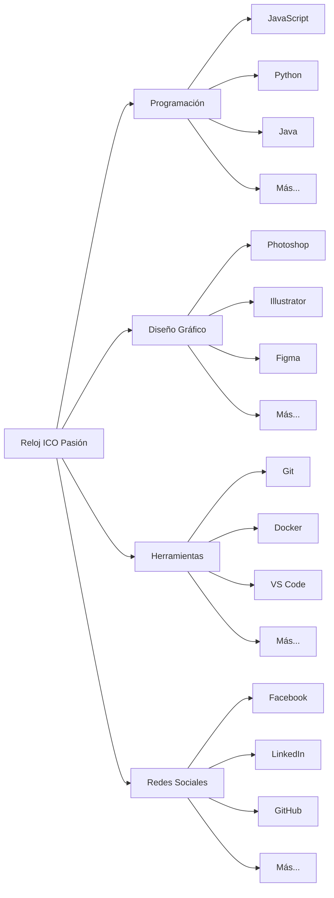

# 🕐 Reloj ICO Pasión - Tech Clock Pro 🚀

<div align="center">
  


[](https://html.spec.whatwg.org/)
[](https://www.w3.org/Style/CSS/)
[](https://developer.mozilla.org/en-US/docs/Web/JavaScript)
[](https://developer.mozilla.org/en-US/docs/Learn/CSS/CSS_layout/Responsive_Design)

### ⚡ **Tu Compañero Tecnológico 24/7** ⚡

*Un reloj interactivo que combina elegancia, funcionalidad y aprendizaje continuo con 60 consejos tecnológicos por hora*

[📧 Contacto](#contacto)

</div>

---

## 📑 Tabla de Contenidos

- [✨ Características](#-características)
- [🎯 Propósito](#-propósito)
- [🛠️ Tecnologías](#️-tecnologías)
- [🚀 Instalación](#-instalación)
- [💻 Uso](#-uso)
- [🎨 Personalización](#-personalización)
- [📱 Responsive Design](#-responsive-design)
- [🔄 Flujo de Trabajo](#-flujo-de-trabajo)
- [📊 Arquitectura](#-arquitectura)
- [🤝 Contribución](#-contribución)
- [📄 Licencia](#-licencia)
- [👨‍💻 Autor](#-autor)

---

## ✨ Características

### 🎯 **Características Principales**

<table>
<tr>
<td width="50%">

#### ⏰ **Reloj Analógico y Digital**
- ✅ Visualización dual (analógica y digital)
- ✅ Manecillas animadas con transiciones suaves
- ✅ Formato 12/24 horas intercambiable
- ✅ Indicador AM/PM para formato 12 horas

</td>
<td width="50%">

#### 🎨 **4 Estilos Visuales*lo
- 🎨 **Normal**: Diseño clásico y elegante
- 🎮 **Pixel**: Estilo retro 8-bit
- 💫 **Neón**: Efectos de brillo futurista
- 🖼️ **Pintura**: Aspecto artístico

</td>
</tr>
<tr>
<td width="50%">

#### 💡 **Sistema de Consejos**
- 📚 60 consejos únicos por tecnología
- ⏱️ Rotación automática cada minuto
- 🔄 12 tecnologías por categoría
- 📊 Total: 2,880 consejos disponibles

</td>
<td width="50%">

#### 🌓 **Modo Claro/Oscuro**
- 🌞 Tema claro para el día
- 🌙 Tema oscuro para la noche
- 💾 Persistencia de preferencias
- 🎨 Transiciones suaves

</td>
</tr>
</table>

### 📦 **Categorías de Tecnologías**



---

## 🎯 Propósito

> **"El tiempo es oro, pero el conocimiento es poder"** 💪

Este proyecto nace de la pasión por combinar:

- 🕐 **Funcionalidad**: Un reloj completo y personalizable
- 📚 **Educación**: Aprendizaje continuo de tecnología
- 🎨 **Diseño**: Interfaz moderna y atractiva
- 📱 **Accesibilidad**: Disponible en cualquier dispositivo

---

## 🛠️ Tecnologías

### **Stack Tecnológico**

<div align="center">

| Tecnología | Descripción | Versión |
|------------|-------------|---------|
|  | Estructura y semántica | 5.0 |
|  | Estilos y animaciones | 3.0 |
|  | Lógica e interactividad | ES6+ |
|  | Iconografía | 6.4.0 |
|  | Tipografías | - |
|  | Logos tecnológicos | Latest |

</div>

---

## 🚀 Instalación

### **Opción 1: Clonación del Repositorio**

```bash
# 1. Clonar el repositorio
git clone https://github.com/tu-usuario/reloj-ico-pasion.git

# 2. Navegar al directorio
cd reloj-ico-pasion

# 3. Abrir en el navegador
# Opción A: Doble click en index.html
# Opción B: Usar un servidor local
python -m http.server 8000
# Luego visitar: http://localhost:8000
```

### **Opción 2: Descarga Directa**

```bash
# 1. Descargar el archivo ZIP
# 2. Extraer los archivos
# 3. Abrir index.html en tu navegador favorito
```

### **Opción 3: Copiar y Pegar**

```html
<!-- Simplemente copia todo el código HTML proporcionado -->
<!-- Guárdalo como index.html -->
<!-- ¡Listo para usar! -->
```

---

## 💻 Uso

### **🎮 Controles Principales**

```
┌─────────────────────────────────────────┐
│         PANEL DE CONTROL                │
├─────────────────────────────────────────┤
│                                         │
│  [▼ Categorías]  [▼ Estilos]          │
│                                         │
│  [🌙 Modo Oscuro] [🕐 24 Horas]        │
│                                         │
└─────────────────────────────────────────┘
```

### **📋 Guía Rápida**

1. **Seleccionar Categoría**: Elige entre Programación, Diseño, Herramientas o Redes
2. **Cambiar Estilo**: Prueba los 4 estilos visuales disponibles
3. **Alternar Tema**: Cambia entre modo claro y oscuro
4. **Formato de Hora**: Alterna entre 12 y 24 horas

---

## 🎨 Personalización

### **🎨 Variables CSS Personalizables**

```css
:root {
  /* Colores principales */
  --bg-gradient-start: #e0e0e0;
  --bg-gradient-end: #b5b5b5;
  
  /* Colores del reloj */
  --reloj-gradient-start: #1c1c1c;
  --reloj-gradient-end: #000000;
  
  /* Colores de las manecillas */
  --color-hora: #4CAF50;
  --color-minuto: #2196F3;
  --color-segundo: #f44336;
}
```

### **⚙️ Configuración de Consejos**

```javascript
// Agregar nueva tecnología
const nuevaTecnologia = {
  class: "devicon-react-plain",
  color: "#61DAFB",
  nombre: "React",
  datos: generarConsejos("React")
};
```

---

## 📱 Responsive Design

### **📊 Breakpoints**

```
┌──────────────┬─────────────┬──────────────┐
│   Desktop    │   Tablet    │    Mobile    │
├──────────────┼─────────────┼──────────────┤
│   > 768px    │  481-768px  │   ≤ 480px   │
│              │             │              │
│   🖥️ 480px   │   📱 320px  │   📱 280px   │
│   Reloj      │   Reloj     │   Reloj      │
└──────────────┴─────────────┴──────────────┘
```

### **📐 Adaptación por Dispositivo**

| Dispositivo | Ancho | Tamaño Reloj | Características |
|------------|-------|--------------|-----------------|
| 🖥️ Desktop | >768px | 480x480px | Todas las funciones |
| 📱 Tablet | 481-768px | 400x400px | Interfaz adaptada |
| 📱 Mobile | 361-480px | 320x320px | Controles simplificados |
| 📱 Small | ≤360px | 280x280px | Diseño compacto |

---

## 🔄 Flujo de Trabajo

### **Diagrama de Flujo del Sistema**

```
┌─────────────────┐
│   INICIO        │
└────────┬────────┘
         │
         ▼
┌─────────────────┐
│ Cargar          │
│ Preferencias    │
└────────┬────────┘
         │
         ▼
┌─────────────────┐     ┌──────────────┐
│ Crear Reloj     │────▶│ Actualizar   │
│ y Marcas        │     │ Cada Segundo │
└────────┬────────┘     └──────┬───────┘
         │                      │
         ▼                      │
┌─────────────────┐            │
│ Cargar Logos    │            │
│ Por Categoría   │            │
└────────┬────────┘            │
         │                      │
         ▼                      │
┌─────────────────┐            │
│ Mostrar Consejo │◀───────────┘
│ Del Minuto      │ Cada 60 seg
└─────────────────┘
```

### **⏱️ Ciclo de Actualización**

```javascript
// Actualización cada segundo
setInterval(actualizarReloj, 1000);

// Rotación de consejos cada minuto
setInterval(cambiarDatoPorMinuto, 60000);

// Cambio de tecnología cada hora
// Automático según la hora actual
```

---

## 📊 Arquitectura

### **🏗️ Estructura del Proyecto**

```
reloj-ico-pasion/
│
├── 📄 index.html           # Archivo principal
├── 📄 README.md           # Documentación
├── 📸 screenshots/        # Capturas de pantalla
│   ├── desktop.png
│   ├── mobile.png
│   └── features.png
│
└── 🎨 assets/            # Recursos (si se separan)
    ├── css/
    │   └── styles.css
    ├── js/
    │   └── script.js
    └── img/
        └── logo.png
```

### **🔧 Componentes Principales**

```
┌────────────────────────────────────┐
│          HEADER                    │
│    [Logo] Reloj ICO Pasión        │
├────────────────────────────────────┤
│          CONTROLES                 │
│  [Categorías] [Estilos] [Botones] │
├────────────────────────────────────┤
│           RELOJ                    │
│      ┌──────────────┐             │
│      │   Analógico  │             │
│      │   + Digital  │             │
│      └──────────────┘             │
├────────────────────────────────────┤
│      PANEL DE INFORMACIÓN         │
│   [Icono] [Título] [Consejos]     │
├────────────────────────────────────┤
│           FOOTER                   │
│    © 2025 Jhorman J. Castellanos  │
└────────────────────────────────────┘
```

---

## 🤝 Contribución

### **¿Cómo Contribuir?**

1. 🍴 **Fork** el proyecto
2. 🔧 Crea tu **Feature Branch** (`git checkout -b feature/NuevaCaracteristica`)
3. 💾 **Commit** tus cambios (`git commit -m 'Add: Nueva característica'`)
4. 📤 **Push** a la rama (`git push origin feature/NuevaCaracteristica`)
5. 🔄 Abre un **Pull Request**

### **📝 Guías de Contribución**

- ✅ Sigue el estilo de código existente
- ✅ Comenta tu código cuando sea necesario
- ✅ Actualiza la documentación
- ✅ Prueba en diferentes navegadores
- ✅ Verifica la responsividad

---

## 📄 Licencia

```
MIT License

Copyright (c) 2025 Jhorman Jesús Castellanos Morales

Permission is hereby granted, free of charge, to any person obtaining a copy
of this software and associated documentation files (the "Software"), to deal
in the Software without restriction, including without limitation the rights
to use, copy, modify, merge, publish, distribute, sublicense, and/or sell
copies of the Software, and to permit persons to whom the Software is
furnished to do so, subject to the following conditions:

The above copyright notice and this permission notice shall be included in all
copies or substantial portions of the Software.

THE SOFTWARE IS PROVIDED "AS IS", WITHOUT WARRANTY OF ANY KIND, EXPRESS OR
IMPLIED, INCLUDING BUT NOT LIMITED TO THE WARRANTIES OF MERCHANTABILITY,
FITNESS FOR A PARTICULAR PURPOSE AND NONINFRINGEMENT. IN NO EVENT SHALL THE
AUTHORS OR COPYRIGHT HOLDERS BE LIABLE FOR ANY CLAIM, DAMAGES OR OTHER
LIABILITY, WHETHER IN AN ACTION OF CONTRACT, TORT OR OTHERWISE, ARISING FROM,
OUT OF OR IN CONNECTION WITH THE SOFTWARE OR THE USE OR OTHER DEALINGS IN THE
SOFTWARE.
```

---

## 👨‍💻 Autor

<div align="center">

### **Jhorman Jesús Castellanos Morales**

[](https://github.com/tu-usuario)
[](https://linkedin.com/in/tu-perfil)
[](mailto:tu-email@gmail.com)

</div>

---

## 📸 Screenshots

<div align="center">

### **🖥️ Vista Desktop**

```
┌─────────────────────────────────────────────┐
│                                             │
│         🕐 RELOJ ICO PASIÓN                │
│                                             │
│            ┌───────────┐                   │
│            │   ⏰      │                   │
│            │  RELOJ    │                   │
│            │ ANALÓGICO │                   │
│            └───────────┘                   │
│                                             │
│      📊 Panel de Información               │
│                                             │
└─────────────────────────────────────────────┘
```

### **📱 Vista Mobile**

```
┌─────────────┐
│   HEADER    │
├─────────────┤
│  CONTROLES  │
├─────────────┤
│    RELOJ    │
│      ⏰     │
├─────────────┤
│    PANEL    │
├─────────────┤
│   FOOTER    │
└─────────────┘
```

</div>

---

## 🎯 Roadmap

### **Versión 1.0** ✅
- [x] Reloj analógico y digital
- [x] 4 estilos visuales
- [x] Modo claro/oscuro
- [x] Sistema de consejos
- [x] Diseño responsive

---

## ❓ FAQ

<details>
<summary><b>¿Necesito conexión a internet?</b></summary>
No, la aplicación funciona completamente offline una vez cargada.
</details>

<details>
<summary><b>¿Puedo agregar mis propios consejos?</b></summary>
Sí, puedes modificar la función `generarConsejos()` en el código.
</details>

<details>
<summary><b>¿Es compatible con todos los navegadores?</b></summary>
Funciona en Chrome, Firefox, Safari, Edge y navegadores modernos.
</details>

<details>
<summary><b>¿Puedo cambiar los colores?</b></summary>
Sí, modifica las variables CSS en la sección `:root`.
</details>

---

## 💬 Contacto

<div align="center">

### **¿Preguntas? ¿Sugerencias? ¡Contáctame!**

📧 **Email**: jhorman.castellanos@example.com  
💼 **LinkedIn**: [Jhorman Castellanos](https://linkedin.com)  
🐙 **GitHub**: [@jhorman-castellanos](https://github.com)  

</div>

---

<div align="center">

### ⭐ **¡Si te gusta este proyecto, dale una estrella!** ⭐

Hecho con ❤️ y ☕ por **Jhorman Jesús Castellanos Morales**

© 2025 - Todos los derechos reservados

</div>

---

```
    _____ _            _      _____ _____ ____    _____           _   __        
   / ____| |          | |    |_   _/ ____/ __ \  |  __ \         (_) /_/        
  | |    | | ___   ___| | __   | || |   | |  | | | |__) |_ _ ___ _  ___  _ __  
  | |    | |/ _ \ / __| |/ /   | || |   | |  | | |  ___/ _` / __| |/ _ \| '_ \ 
  | |____| | (_) | (__|   <   _| || |___| |__| | | |  | (_| \__ \ | (_) | | | |
   \_____|_|\___/ \___|_|\_\ |_____\_____\____/  |_|   \__,_|___/_|\___/|_| |_|
```
